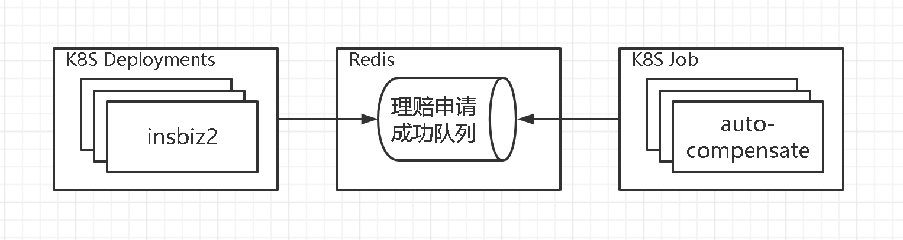
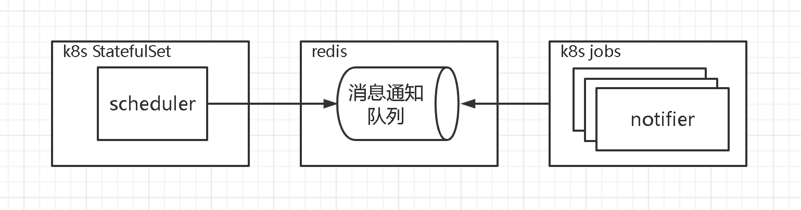
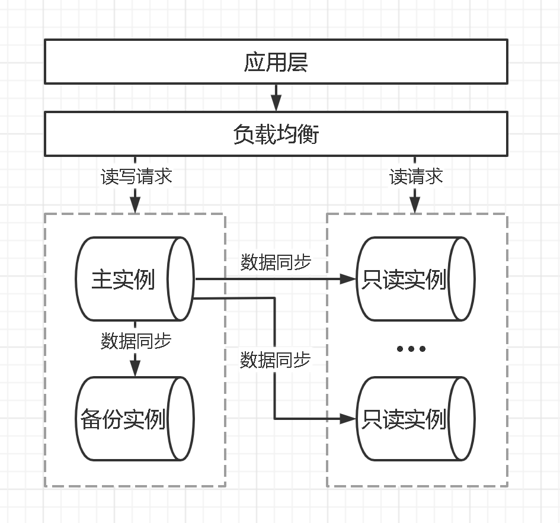
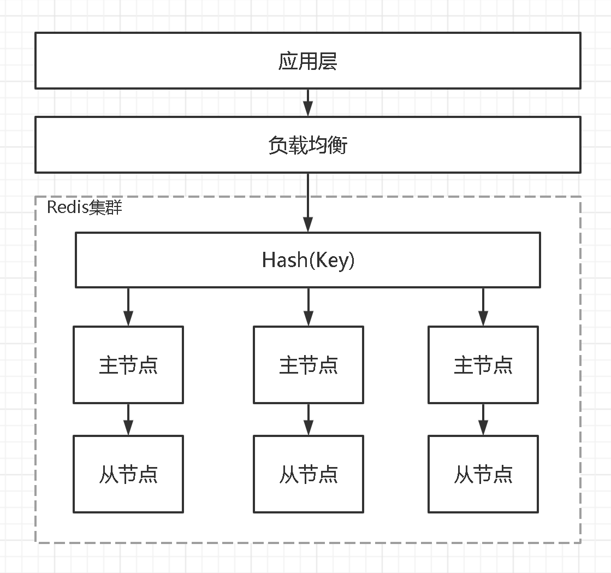

# 业务倍增阶段系统改造<!-- omit in toc -->

- [1. 概览](#1-概览)
  - [1.1. 架构对比](#11-架构对比)
  - [1.2. 部署方式对比](#12-部署方式对比)
- [2. 综合改造](#2-综合改造)
  - [2.1. 应用程序集群部署](#21-应用程序集群部署)
  - [2.2. MySQL 集群部署](#22-mysql-集群部署)
  - [2.3. Redis 集群部署](#23-redis-集群部署)
  - [2.4. 静态资源托管到 CDN](#24-静态资源托管到-cdn)
- [4. 其他高扩展性改造](#4-其他高扩展性改造)
  - [4.1. MySQL](#41-mysql)
- [5. 其他高性能改造](#5-其他高性能改造)
  - [5.1. insbiz](#51-insbiz)
  - [5.2. opsmgt-backend](#52-opsmgt-backend)
  - [5.3. MySQL](#53-mysql)

## 1. 概览

福保经过前期的不断验证，相关保险业务基本跑通并逐步起量，增量约可达到十倍以上，本阶段的关键词是 “**稳定、大流量**”。对此，需对现有系统进行 “**高性能&高可用&高扩展**” 的升级改造，支持 200 TPS 以上的保单吞吐量，[压测记录>>]()。

相关工程：

- 待补充。

### 1.1. 架构对比

改造前：待补充

改造后：待补充

### 1.2. 部署方式对比

改造前：待补充

改造后：待补充

## 2. 综合改造

### 2.1. 应用程序集群部署

在整体的改造进程中，最优先对应用程序进行集群式部署，因为这从高可用和高扩展层面来说都是必不可少的，且同时还提升了性能。

主要是通过 Kubernetes 来实现，它由两个部分构成，其一是对集群进行全局控制的 “控制平面”，另外是用于运行容器化应用程序的 “工作节点”，大概如下图 1 所示，[详细结构>>](https://github.com/itabbot/learn/tree/main/Kubernetes#3-结构和组件)。为了达到高可用和高扩展的目的，“控制平面” 也需要以集群的方式单独部署，大概如下图 2 所示，[详情拓扑>>](https://github.com/itabbot/learn/blob/main/Kubernetes/最佳实践/部署高可用高扩展的控制平面集群.md)。

此外，在原 [insbiz](https://github.com/fooins/insbiz) 工程中，除了主要的 Web 服务之外，还有一个定时作业调度功能，该功能此时主要是调度 “自动理赔” 和 “消息通知” 两个作业，它们都是以查询 MySQL 特定条件的数据来进行处理的，冗余部署的话会导致重复处理，也无法达到扩展的目的。所以，需要对其进行针对性的改造。最终拆分为 [insbiz2](https://github.com/fooins/insbiz2)、[auto-compensate](https://github.com/fooins/auto-compensate)、[scheduler](https://github.com/fooins/scheduler) 和 [notifier](https://github.com/fooins/notifier) 几个工程，大致如下图所示。[改造细节>>](./作业调度功能高可用性及高扩展性改造.md)。

### 2.2. MySQL 集群部署

MySQL 承担了几乎所有的数据存储和检索工作，保障其稳定高效是整个平台的重中之重。这里采用 “一主一备多只读” 的部署方式，主节点故障自动转移，实现高可用。只读节点使用负载均衡分发读流量，实现读方向高扩展。

应用程序侧则灵活使用读写/只读地址连接数据库。

### 2.3. Redis 集群部署

Redis 目前主要是提供保单号序列的原子操作，本次系统改造升级后，会使用其 Stream 功能并大量用于数据缓存，所以需要对其进行集群部署。大致结构如下：

### 2.4. 静态资源托管到 CDN

前端工程 [opsmgt-frontend](https://github.com/fooins/opsmgt-frontend) 构建后输出的静态资源托管到 CDN，一次性解决高可用、高扩展、高性能等问题。

## 4. 其他高扩展性改造

### 4.1. MySQL

## 5. 其他高性能改造

### 5.1. insbiz

### 5.2. opsmgt-backend

### 5.3. MySQL
