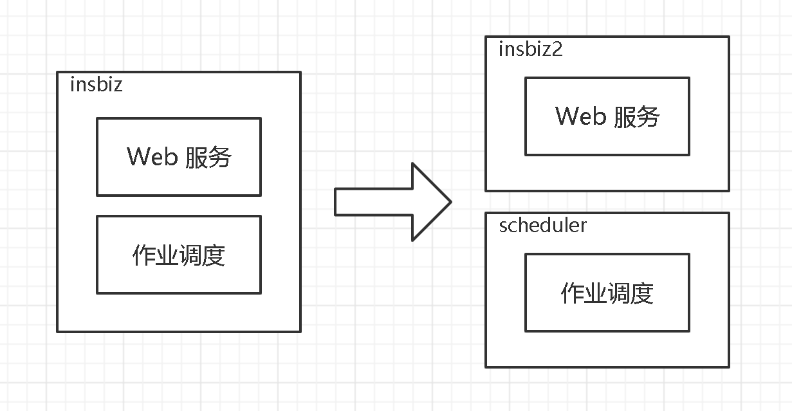

# 作业调度功能高可用性及高扩展性改造<!-- omit in toc -->

在原 [insbiz](https://github.com/fooins/insbiz) 工程中，除了主要的 Web 服务之外，还带有一个定时作业调度功能，该功能此时主要是调度 “自动理赔” 和 “发送理赔状态通知” 两个定时作业。这两个作业都是通过查询 MySQL 数据表的数据来执行操作的，特别是 “发送理赔状态通知” 作业，还拥有通知失败阶梯式重发功能，属于 “有状态” 类型的服务，所以不能进行简单的冗余部署。

为了实现高可用性和高扩展性，需要对其进行针对性的改造。

## 服务拆分

首先，将作业调度功能从 [insbiz](https://github.com/fooins/insbiz) 工程中抽离出来，将它们解耦，拆分为 [insbiz2](https://github.com/fooins/insbiz2) 和 [scheduler](https://github.com/fooins/scheduler) 两个工程。现在 insbiz2 中只有 Web 服务，是无状态的，可以正常进行冗余部署，scheduler 则需要进行进一步的改造。如下图所示：

## 高可用性改造

scheduler 服务只能单实例运行，如果出现故障，将对业务产生影响。对此，使用 Kubernetes 的 StatefulSet 对 scheduler 进行部署并单实例运行，当 scheduler 服务不可用时，Kubernetes 会对其进行重启，保障高可用性。重启可能需要点时间，对于非实时在线业务功能来说，是可以接受的。

## 搞扩展性改造

由于业务量的倍增，可能会达到作业程序单节点处理能力的上限。对此，将所有作业均调整为分发逻辑，将具体的作业处理逻辑从 scheduler 服务中抽离出来作为子作业服务。

scheduler 服务仅执行作业分发工作，通过消息队列分发给下游的子作业服务，scheduler 单实例可分发调度大量作业，能满足现阶段要求。因为是非在线实时业务，所要这里的消息队列使用轻量的 Redis Stream 来实现，且整体架构中本来就有 Redis，所以也比较方便。

子作业服务使用 Kubernetes 的 Job 进行部署，订阅消息队列进行点对点处理。可根据实际情况调节子作业服务的数量，实现扩展。拆分后，“自动理赔” 子服务为 [auto-compensate](https://github.com/fooins/auto-compensate)，“发送理赔状态通知” 自服务为 [notifier](https://github.com/fooins/notifier)。

整体如下图所示：

