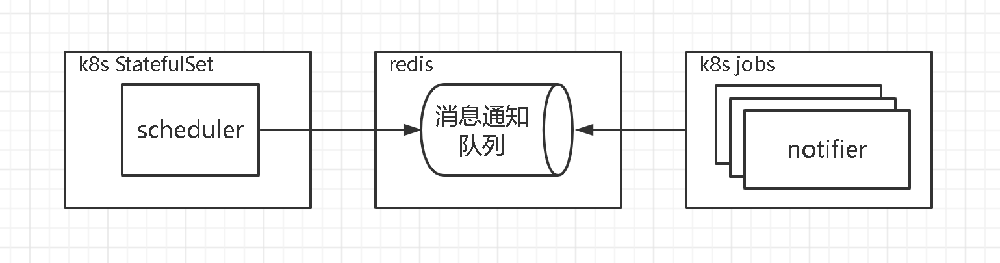

# 作业调度功能高可用性及高扩展性改造<!-- omit in toc -->

在原 [insbiz](https://github.com/fooins/insbiz) 工程中，除了主要的 Web 服务之外，还有一个定时作业调度功能，该功能此时主要是调度 “自动理赔” 和 “消息通知” 两个作业：

- 自动理赔作业：支持自动理赔的产品在理赔申请成功后会在 “自动理赔任务表” 中添加一个任务，本作业会定时去查询该表中符合要求的任务并执行自动理赔处理。
- 消息通知作业：一些特定的业务功能在需要消息通知外部系统时（比如理赔单状态变更时）会往 “通知任务表” 添加一个任务，本作业会定时查询该表中符合条件（未发送或需重发的）的任务并执行发送。

这两个作业都是查询 MySQL 特定条件的数据来进行处理，冗余部署的话会导致重复处理，也无法达到扩展的目的。所以，需要对其进行针对性的改造。

## 自动理赔作业改造

当理赔申请成功后，原来是会在 “自动理赔任务表” 中添加一个任务，然后定时去执行。这里改造为：当理赔申请成功后，往 “理赔申请成功” 的队列添加一条消息，然后通过消费者组来消费这些消息，执行自动理赔处理。这样自动理赔作业程序就可以进行冗余部署，实现高扩展性。

[insbiz](https://github.com/fooins/insbiz) 工程后续会进行大量的改造，所以复制为一个新的工程 [insbiz2](https://github.com/fooins/insbiz2)。然后将 “自动理赔作业” 抽离出来为独立的工程 [auto-compensate](https://github.com/fooins/auto-compensate)，并使用 Kubernetes 的 Job 进行部署。消息队列则使用轻量的 Redis Stream 来实现。如下图所示：

这样做还有一个好处：理赔申请成功后添加的队列消息，相当于是一个 “理赔申请成功” 事件，可以通过订阅它来完成更多的相关功能或流程，且不影响核心的理赔申请逻辑，实现前端核心业务与下游次要流程解耦。

## 消息通知作业改造

一些特定的业务功能在需要消息通知外部系统时（比如理赔单状态变更时）会往 “通知任务表” 添加一个任务，然后定时去执行。这里可以像 “自动理赔作业改造” 那样改造，但是 “消息通知作业” 还有一种场景是通知失败后要进行阶梯式重试，所以还是得保留 “通知任务表” 来记录需要重试的任务。

“消息通知作业” 定时去查询符合条件的任务来进行处理，这里改造为：只查询但不处理，而是分发。查询到数据后，分发到 “消息通知” 队列，然后通过消费者组来消费这些消息，执行消息通知处理。这样单实例的 “消息通知作业” 也能分发大量的任务，执行消息通知的程序也可以进行冗余部署，实现高扩展性。

将 “消息通知” 的处理逻辑抽离出来为单独的工程 [notifier](https://github.com/fooins/notifier)，并使用 Kubernetes 的 Job 进行部署。作业调度功能则从 [insbiz2](https://github.com/fooins/insbiz2) 工程中抽离出来为单独的工程 [scheduler](https://github.com/fooins/scheduler) 并使用 Kubernetes 的 StatefulSet 进行单实例部署，如果出现不可用时 Kubernetes 会对其进行重启或重建，保障其高可用。消息队列同样使用轻量的 Redis Stream 来实现。如下图所示：

