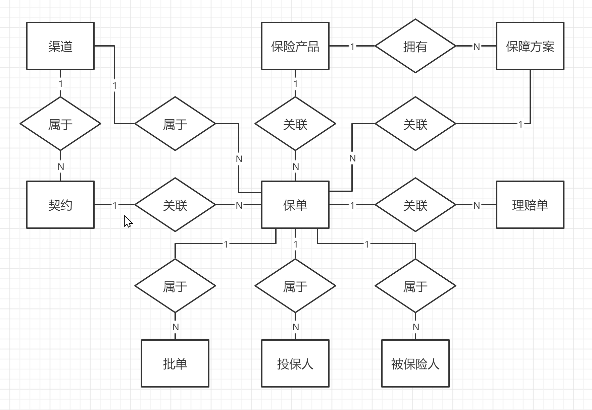

# 成立初期系统设计 <!-- omit in toc -->

## 1. 概述

结合保司本阶段的实际业务情况，主要需开发两个系统：一个是提供前端电商/支付平台接入的 “保险业务系统”，纯 API 接入无需界面；另一个是面向内部人员的 “运营管理系统”，支撑日常的运营和管理工作。如下图所示：

验收标准：

- “保险业务系统” 需处理约每日 2 万次的承保请求，高峰期达到每秒 2 次，API 平均响应时长不超过 3 秒。
- 预估每 1 次承保请求相应会有 2 次报价、1 次查询保单以及 0.5 次理赔申请。
- 高峰期需不影响 “运营管理系统” 的正常使用。
- 在拥有一定基数的数据量情况下也要能正常运转。比如持续运作一年共计 730 万保单和 365 万理赔单。

## 2. 实施思路

### 2.1. 退货运费险

| 序  | 角色 | 场景名称 | 场景描述 | 实施思路 |
| :-: | :--: | -------- | -------- | -------- |
| 1 | 买方 | 选择运费险 | 买方在电商平台下单购物时，可自行决定是否勾选运费险产品，运费险选项处可查看预估报价以及保险产品信息（包括承保公司、保险条款、投保须知以及相关流程等等）。 | 线下给电商平台提供保险产品相关资料，由他们自行组织展示；可调用 “保险业务系统” 的接口获取实时报价。 |
| 2 | 卖方 | 赠送运费险 | 卖方可提前在电商后台开通卖方赠送运费险服务，买方选品或下单时均会显示卖方赠送运费险，运费险费用由卖方支付。 | 电商平台自行实施。 |
| 3 | 卖方 | 发货 | 卖方确认发货并录入物流单号时，电商平台会向保司投保运费险。 | 调用 “保险业务系统” 接口进行投保，并同步获得投保结果。 |
| 4 | 买方 | 查看保单 | 买方可以通过电商平台订单详情页的运费险相关入口查看运费险保单详情；也可以拨打保司客服电话进行查询。 | 1）前端电商平台调用 “保险业务系统” 接口，通过保单号查询保单详细信息（可缓存保单）； 2）保司客服人员接到客户的查询保单请求时，可通过内部 “运营管理系统” 查询保单。 |
| 5 | 买方 | 获取电子保单 | 买方可以通过拨打保司客服电话获取电子保单。 | 此场景为小概率事件，当保司客服人员接收到客户的获取电子保单请求时，可以让客户留下电子邮箱地址或邮寄地址，然后转交由核保人员手工开具并通过电子邮件发送给客户或通过快件邮寄给客户（到付）。 |
| 6 | 买方 | 开具发票 | 买方可以通过拨打保司客服电话开具发票。 | 保司客服人员接收到客户的开具发票请求时，可以让客户留下电子邮箱地址或邮寄地址，然后转交由财务人员手工开具并通过电子邮件发送给客户或通过快件邮寄给客户（到付）。 |
| 7 | 买方 | 网购退货 | 买方收到网购商品后退货时，需填入退货物流单号，待卖方确认收到退货商品后，电商平台自动发起理赔，赔付款会自动支付到买方账户。 | 调用 “保险业务系统” 接口发起理赔申请，同步获得理赔单号，等待理赔单状态变化时，会通过电商平台预留的接口地址通知到对方。 |
| 8 | 买方 | 填错退货单号 | 买方退货时输错物流单号，导致理赔失败，可以重新输入正确的物流单号并重新触发理赔。 | 使用理赔单号调用 “保险业务系统” 接口更新理赔单信息，触发重新理赔。 |
| 9 | 保司财务 | 渠道结算 | 目前渠道合作的结算方式仅支持月结，保司财务人员每月需通过对账单与渠道进行结算。 | 在内部 “运营管理系统” 导出渠道对账单。 |
| 10 | 保司业务员 | 业务统计分析 | 业务员需要定期通过渠道、产品、方案以及时间等多个维度对业务情况进行分析。 | 在内部 “运营管理系统” 查看或导出相关的统计信息。 |

### 2.2. 账户安全险

| 序  | 角色 | 场景名称 | 场景描述 | 实施思路 |
| :-: | :--: | -------- | -------- | -------- |
| 1 | 支付平台 | 赠送存量客户基本保障 | 支付平台默认为每个账户投保账户安全险，系统会分次批量给存量账户进行投保。 | 支付平台将存量用户导出交由保司开发人员人工执行批量投保。 |
| 2 | 支付平台 | 赠送新客户基本保障 | 新增的客户系统会自动为其投保。 | 调用 “保险业务系统” 的接口进行投保，并同步获得投保结果。 |
| 3 | 客户 | 免费升级保障 | 支付平台提示客户可免费升级保障，由客户自行了解详情并决定是否升级保障，确认后支付平台发起保障升级。 | 调用 “保险业务系统” 接口批改保单的保障方案，并同步获得批改结果。 |
| 4 | 客户 | 续保 | 保障到期后，支付平台会提醒客户并由客户自行了解详情并决定是否续保，确认后支付平台发起续保。 | 调用 “保险业务系统” 接口进行续保。若保险产品已经下架，则需引导用户选择新的保险产品进行投保。 |
| 5 | 客户 | 退保 | 客户可在支付平台选择退保。 | 调用 “保险业务系统” 接口取消保单，并同步获得取消结果。 |
| 6 | 客户 | 查看保单 | 客户可以通过支付平台的相关入口查看保单详情；也可以拨打保司客服电话进行查询。 | 同 “退货运费险”。 |
| 7 | 客户 | 获取电子保单 | 客户可以通过拨打保司客服电话获取电子保单。 | 同 “退货运费险”。 |
| 8 | 客户 | 理赔 | 客户发现账户被盗后，可以在支付平台或拨打保司客服电话发起理赔申请。 | 1）支付平台调用 “保险业务系统” 接口发起理赔申请，同步获得理赔单号，等待理赔单状态变化时，会通过支付平台预留的接口地址通知到对方。 2）保司客服人员接收到客户的理赔请求时，在 “运营管理系统” 中创建理赔单，并交由相关人员流转。 |
| 9 | 保司财务 | 渠道结算 | 目前渠道合作的结算方式仅支持月结，保司财务人员每月需通过对账单与渠道进行结算。 | 同 “退货运费险”。 |
| 10 | 保司业务员 | 业务统计分析 | 业务员需要定期通过渠道、产品、方案以及时间等多个维度对业务情况进行分析。 | 同 “退货运费险”。 |

### 2.3. 运营支撑场景

| 序  | 角色 | 场景名称 | 场景描述 |
| :-: | :--: | -------- | -------- |
| 1 | 保司核保 | 新增保险产品 | 保司核保等相关人员设计定义好保险产品后，需要在内部 “运营管理系统” 中创建对应的保险产品。 |
| 2 | 保司核保 | 修改保险产品 | 当保险产品相关信息发生变更时，需要在内部 “运营管理系统” 中对该保险产品进行修改。 |
| 3 | 保司核保 | 发布保险产品 | 在内部 “运营管理系统” 中新增或修改保险产品后，需要对其进行发布操作，才可以允许被授权给渠道（电商平台/支付平台）售卖。 |
| 4 | 保司核保 | 下架保险产品 | 当需要终止某些保险产品的售卖时，可以在 “运营管理系统” 对其进行下架操作。 |
| 5 | 保司业务员 | 给渠道授权 | 保司业务员可以在内部 “运营管理系统” 将已发布的产品授权给指定的渠道（电商/支付平台）进行售卖，并设置相关的费率、权限等。 |
| 6 | 保司业务员 | 取消授权 | 当需要终止渠道的产品授权时，可以在内部 “运营管理系统” 中对相应的契约进行取消操作，取消后将不再允许该契约的投保。 |
| 7 | 保司业务员 | 修改授权 | 当渠道的契约信息发生变更时（比如费率、权限等），可以在内部 “运营管理系统” 修改渠道的授权契约信息，修改后新出的保单将使用新的契约。 |
| 8 | 保司业务员 | 添加渠道 | 当有新的渠道需要接入时，可以在 “运营管理系统” 中添加对应的渠道，并设置相关的配置信息（比如数据订阅接口、接入凭证等）。 |
| 9 | 保司业务员 | 修改渠道信息 | 当渠道相关信息发生变更时，需要在 “运营管理系统” 中对其进行更新。 |
| 10 | 保司业务员 | 关闭渠道 | 当需要终止渠道合作时，可以在 “运营管理系统” 中对其进行关闭，关闭后该渠道将无法进行投保等操作。 |

## 3. 功能清单

### 3.1. 保险业务系统

| 序  | 功能 | 实现思路 |
| :-: | :--: | -------- |
| 1 | 报价 | 等同于承保功能的前半部分。 |
| 2 | 承保 | 大概包括规则校验、计费、出保单号、保存入库等处理过程。 |
| 3 | 查询保单 | 通过保单号直接查库。 |
| 4 | 申请理赔 | 接口收单入库；运费险产品由定时任务受理并自动赔付；理赔状态变更时插队列异步通知渠道（失败重试）。 |
| 5 | 更新理赔单 | 可更新未完结的理赔单；生成变更记录；触发重新理赔。 |
| 6 | 批改保单 | |
| 7 | 续保 | |
| 8 | 退保 | |

### 3.2. 运营管理系统

| 序  | 功能 | 实现思路 |
| :-: | :--: | -------- |
| 1 | 查询保单 | |
| 2 | 导出对账单 | |
| 3 | 查询统计报表 | |
| 4 | 申请理赔 | |
| 5 | 创建保险产品 | |
| 6 | 修改保险产品 | |
| 7 | 发布保险产品 | |
| 8 | 下架保险产品 | |
| 9 | 授权渠道 | |
| 10 | 终止契约 | |
| 11 | 更新契约 | |
| 12 | 添加渠道 | |
| 13 | 更新渠道 | |
| 14 | 关闭渠道 | |

## 4. 关键实现

### 4.1. 规则引擎

### 4.2. 计费引擎

### 4.3. 出单引擎

## 5. 数据表结构

使用 MySQL 数据库存储数据，基本的实体关系如下图所示，详细的 DDL 请 [点击查阅>>](./sql/)。

