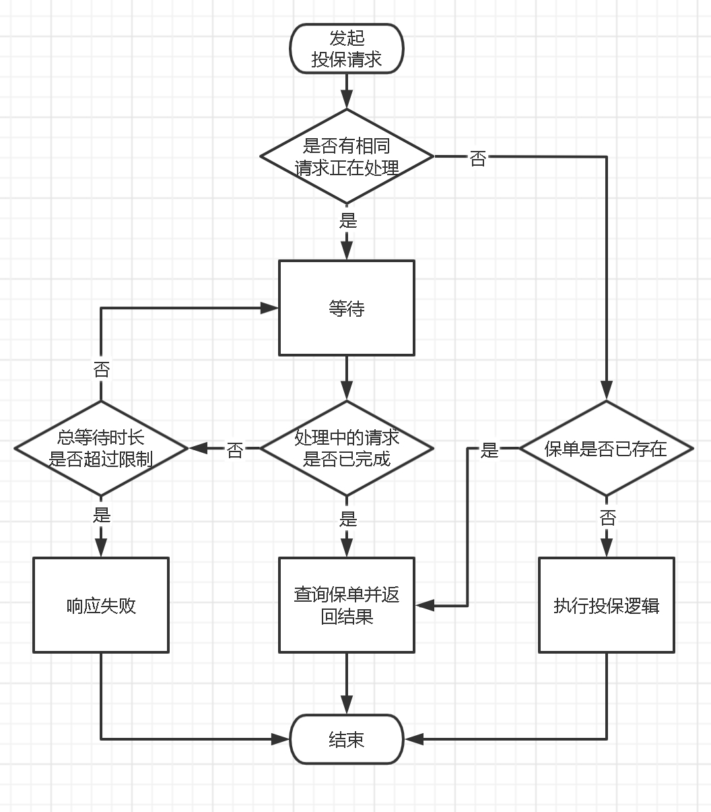

# 接口幂等<!-- omit in toc -->

**实际问题**：当出现网络延迟或服务端响应缓慢时，客户端可能会中断请求，导致无法接收到处理结果。如果再次尝试可能会得到 “重复操作” 的错误提示；短时间内重试的话，还可能导致数据重入。

**解决思路**：实现接口幂等。当客户端使用相同的参数请求同一个接口时，将得到相同的结果，且不会造成额外的影响。特别是针对短时间内多次重试的情况，需要串行处理。此外，不同功能之间也存在差异，需要根据实际情况灵活调整策略。

## 1. 承保接口幂等方案

事先，与每个接入的渠道约定：当投保超时进行重试时，使用同一个订单号且使用相同的请求参数。此外，为数据库保单表添加 “渠道 ID + 订单号” 的组合唯一索引，作为兜底策略。

如下图所示，当一个投保请求进来时：

1. 先判断是否有相同请求正在处理：使用 “订单号+投保人+被保险人” 组合主键（MD5 缩短长度）在 Redis 中占位（原子操作），占位成功表示没有其他请求正在处理。接口逻辑处理完成后清除该占位标识。
2. 存在相同请求时：本次请求可能是接口重试。随机等待一定的时长（可控范围内），然后再次进行 Redis 占位，占位成功表示之前的请求处理成功，此时直接查询保单数据并返回成功结果。最后清除该占位标识。
3. 等待超过一定时长后：响应客户端处理超时。

