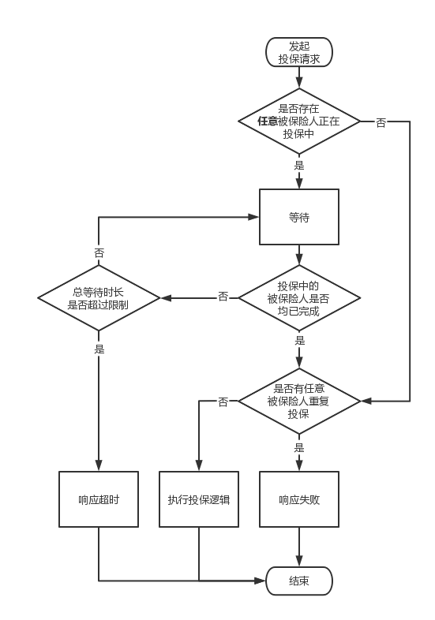

# 重复投保校验

实际问题：重复投保意味着保司需要承担多倍的风险，当被保险人出险时，保司需要赔付多倍的保额。这无疑会给保司造成巨大的亏损，同时也会给恶意骗保之徒提供了可乘之机。

解决思路：每次投保时，实施实时重复投保验证，拦截不符合要求的投保请求。

方案细节：如下图所示，当一个投保请求进来时，

1. 先判断是否有任意一个被保险人正在投保中：依次对每个被保险人使用 “姓名+证件类型+证件号码” 组合主键在 Redis 中占位（原子操作），全部占位成功表示没有被保险人正在投保。接口逻辑处理完成后清除全部占位标识。
2. 存在任意被保险人正在投保时：随机等待一定的时长（可控范围内），然后再次进行 Redis 占位，全部占位成功表示之前的投保处理完毕，否则等待超过一定时长后响应客户端处理超时。
3. 判断是否有任意被保险人重复投保：根据重复投保规则查询数据库，查询到数据则表示重复投保。

